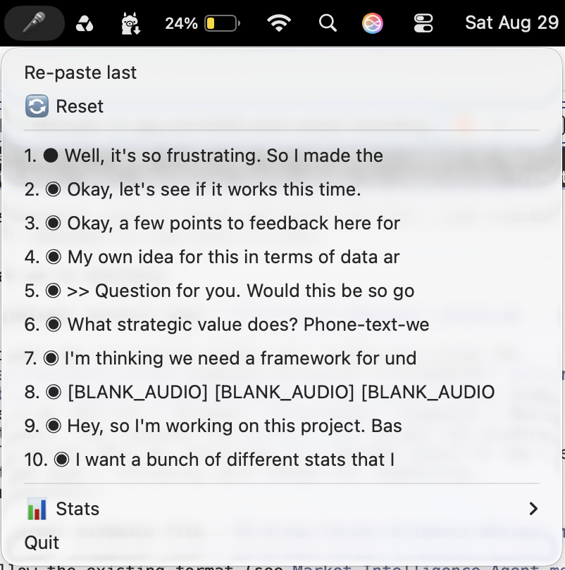
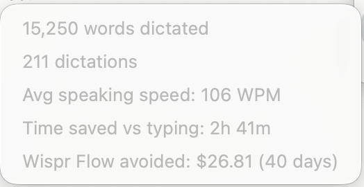
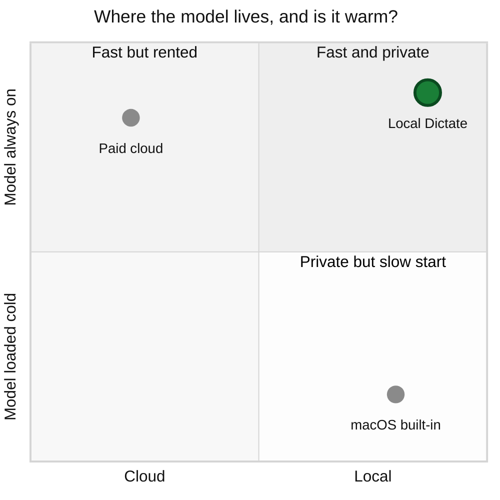

# Local Dictate

Push-to-talk voice dictation for macOS. Tap a key, talk, tap again, and cleaned-up text lands at your cursor. No window, no cloud, no account, works on a plane.

The entire interface. 🎤 idle, 🔴 recording, ⏳ transcribing, back to 🎤. Nothing else appears on screen.

| History | Lifetime stats |
|---|---|
|  |  |

## What it does

- Tap Right Option. Talk. Tap again. The text appears where your cursor already is.
- Transcribes with `whisper.cpp`, then cleans punctuation, casing, and filler with a local Gemma model.
- Keeps a menu-bar history, so a paste that misses is never a dictation you lost.
- Tap Right Command to paste the last result again.
- Tracks words, dictations, and speaking speed over time.

In daily use since July 2026. As of 2026-09-19: **396 dictations, 29,029 words, 4.5 hours of audio.**

## Why I built this

**Cloud dictation feels instant because someone else pays to keep a model warm around the clock. You pay them back in money, privacy, and a network connection. Local models finally got small enough that I can keep one warm myself.**

That is the entire product.

Keeping the model warm is what buys the speed. Skipping the network call is what pays for a second model to clean up punctuation and filler.

So you get cloud-level responsiveness, formatting the built-in tool has never done, and privacy for free.

**macOS dictation is private and cold.** Free, on-device, already installed. That makes it the honest bar to clear.

The problem is warm-up. If you dictate in bursts through the day, it behaves like the model gets unloaded between uses, and you pay the start-up cost almost every time.

It also stops at punctuation. No filler removal, no formatting.

**Paid cloud dictation is fast and rented.** The model is always on because it lives on someone else's server.

It is well built. The price is a subscription, your audio leaving your machine, an overlay in the middle of your screen, and long dictations that sometimes stall.

It is also built for needs I do not have: per-app voice profiles, tone switching, screen context.

**And it does not work on a plane.** Being offline is when I most want to be writing, and a cloud tool is exactly zero use there. That is not an edge case for me. It is the case.

**The top-right quadrant was empty, and until recently it had to be.** Keeping a model resident only works if it is small enough to sit in memory next to everything else, and accurate enough to be worth the space.

That combination is recent. The edge-tuned Gemma line this runs on arrived in June 2025, and the version I use shipped in April 2026.

Local means private and offline for free, not as features I built. Small models mean I can afford the RAM to keep them warm.

### How I decided what to build

I built almost nothing. Sorted with a Kano lens:

- **Must-be.** Works with no internet. Transcribes accurately. Gets capitalization and basic punctuation right. Lands the text at the cursor and never silently loses it. Nobody praises a dictation tool for any of this. Missing one of them ends it.
- **Performance.** Speed, and only speed. It is the one axis where "better than the built-in one" gets felt instead of argued.
- **Delight.** The formatting that goes past the minimum: filler words removed, spoken lists turned into real lists, spoken punctuation commands honored. Re-paste and lifetime stats. Cheap to build, and the reason to leave something free that already works.
- **Indifferent.** App awareness, tone control, vision context. Enormously expensive and worth nothing to me. This is exactly why the middle of the market was empty: the high end spent its whole budget here.
- **Reverse.** The on-screen overlay. Not a feature I was neutral about. A feature that got worse the more present it was.

**The expensive tool fails a must-be.** No internet, no product.

Must-be attributes do not trade against anything. No amount of tone control buys it back.

More speed and more delight, without adding a single thing to the interface. The moment the UI gets more complicated, I have started building the product I did not want.

## Product decisions and tradeoffs

Four decisions where I picked one thing and gave up another. The first one is the product. The other three are what it forced.

### 1. Keep the models resident, and pay for it in RAM

**The options.** Load a model when it is needed and release it after, or keep it resident and eat the memory.

**What shipped.** Whisper loads once at startup and stays. Ollama is pinged proactively to stay warm: when recording starts, when the Mac wakes from sleep, and on an 8-minute heartbeat that sits inside Ollama's 10-minute `keep_alive` window.

**Why.** This is the one decision the logs settled rather than my intuition. Across all production use, the cleanup pass failed 104 times.

Only 8 were the failures I had designed against, like the model rambling or truncating. **96 were the model having gone cold** and blowing the timeout.

A cold model does not give you a slow dictation. It gives you a raw unpunctuated one, which is the whole feature silently not working.

The tempting fix was a longer timeout. I rejected it.

The timeout ceiling is held under 4 seconds and a test fails the build if it creeps up. Time spent waiting on cleanup is time stolen from the latency budget. Warming attacks the cause.

I also planned to unload Whisper when idle, then measured and dropped it: the app idles at 0.1% CPU and about 126MB, so unloading a small model buys nothing and adds a reload stall on the next dictation.

**What it cost.** Memory. Ollama's server holds roughly 7GB resident during an active session. On a machine with less headroom this would be the wrong call, and it is the first thing I would revisit.

### 2. A menu-bar icon, not a floating indicator

**The options.** Every dictation tool needs to answer "am I recording right now?" The common answer is an on-screen overlay near your cursor or at the bottom of the screen. The PRD called for a floating pill and named it "strongly preferred."

**What shipped.** A menu-bar icon that changes with state: 🎤 idle, 🔴 recording, ⏳ transcribing. No overlay, no window anywhere in the app.

The Dock icon is suppressed via `LSUIElement`, which `docs/PERMISSIONS.md` flags so nobody reports it as a bug.

**Why.** The overlay was the specific thing I disliked about the paid tool. Dictation is something you do *while* doing something else, so anything in the middle of the screen competes with the work.

The menu bar already exists and already holds status. It costs no attention until you look at it.

**What it cost.**
- No live transcript as you speak. That is an explicit non-goal, not an oversight.
- Status is glanceable but not unmissable. If you are full-screen in another app you have to look up.
- History is two clicks away instead of zero.
- On notched Macs the bar is two strips with a dead zone, and macOS will place an overflow item under the notch where it is invisible while still reporting itself as visible. Not fixable in code, because the OS owns placement. The app logs a warning naming the problem instead of pretending it is healthy.

### 3. Smaller models on purpose

**The options.** `whisper.cpp` ships in sizes from tiny through large. Ollama runs Gemma at several sizes. Bigger is more accurate and slower.

**What shipped.** `base.en` for transcription, `gemma4:e2b` for cleanup. Both near the small end.

**Why.** Inference speed is the obvious reason. The real one is decision 1: **small is what makes resident affordable.**

A cold good model loses to a warm adequate one every time. Size is not an accuracy dial here. It is the price of staying warm.

A cleanup pass downstream changes the math too. Transcription does not have to nail punctuation and casing, because the second model fixes exactly those things.

**What it cost.** Real accuracy, on hard audio. Accented speech, background noise, and unusual proper nouns come back worse than a larger model would give me.

**Being honest about how this was decided.** I scoped a proper bake-off in `eval/README.md` comparing `whisper.cpp`, `faster-whisper`, and `distil-whisper` on word error rate, speed, and battery. I never recorded the ground-truth corpus and never ran it. `base.en` shipped as the reasoned default and stayed because daily use was good enough. So this is a judgment call I can defend, not a measurement I can show you.

### 4. When cleanup might have dropped words, paste the raw transcript instead

**The problem.** The cleanup model has one job and one hard rule: fix punctuation and filler, change nothing else. It may not answer a question inside your dictation, improve your phrasing, or add a fact.

The system prompt is locked. The eval will not let it be edited without re-running.

It broke anyway, in a way I did not predict. Say *"we should ship it exclamation point that is bold huge end bold news"* and Gemma sometimes read the spoken punctuation as the end of the input and returned just *"We should ship it!"* The rest was gone. Not mangled, not flagged, gone.

**What shipped.** A deterministic check that compares surviving word count against the raw transcript. If too much vanished, the cleaned version is thrown away and you get your raw text.

**Why.** Silent loss is the failure that ends trust in a dictation tool. You cannot notice what is not there, and you cannot say it again the same way. So the guard prefers ugly output over short output.

**What it cost.** Occasionally you see the literal words "exclamation point" in your text. That is the guard working. It beats finding out half a paragraph went missing.

Cleanup can fail in four ways and every one falls back to the raw transcript rather than an error. Audio is written to disk before transcription starts. Every stage checkpoints before the next begins.

One principle in four places: degrade, never drop.

## What success looked like, before I built it

`PRD.md` set these targets on 2026-07-19, before any code existed. Measured across 425 latency samples in `logs/latency.log`:

| Target, set before building | Actual |
|---|---|
| Short clip (≤3s): ≤ 1.0s, key-release to pasted | **185ms** median ✅ · p90 1.04s, just over |
| Long clip: ≤ 2.5s, hard ceiling 4s | **1.7s** median ✅ · p90 3.3s ✗ over target, inside ceiling |
| Recoverable in ≤ 2 clicks, zero silent data loss | met |
| Cleanup never changes meaning | enforced at runtime, see decision 4 |

The long-clip p90 is the real miss. The median is comfortably inside budget but the tail runs over. Streaming transcription would close it and is not built.

Two features were planned and then cut by measurement rather than opinion. Chunked transcription was dropped because a 59-second clip already pasted in 2.2 seconds, inside budget. Idle model unloading was dropped for the footprint reason in decision 3.

The bar I actually used, from the project's `CLAUDE.md`: **"would this annoy me on the 30th dictation of the day?"** Working once in a demo is not the same as surviving a Tuesday.

## Process

Built by orchestrating three tiers of AI model with an explicit division of labor.

- **Architect and reviewer tier** took the judgment-heavy, project-killing parts: the OS-integration spike, the cleanup system prompt, the durability state machine, and adversarial review of the two failure modes that would have sunk it (lost text, cleanup that changes meaning).
- **Workhorse tier** did the bulk: pipeline glue, menu-bar UI, job store, retry logic, the eval harness.
- **Mechanical tier** got narrow, unambiguous work only. It never touched a named failure mode.

The guiding rule: **optimize for the fewest total tokens to reach correct code, not the lowest price per token.** A cheap pass that needs three corrections and a senior review costs more than one good pass. Full writeup in `WORKPLAN.md`.

Six failure modes were named in the PRD before implementation started, and every phase was gated against them.

## Privacy

There is no server, no account, and no telemetry. Concretely, here is everything that touches your speech:

| What | Where it goes |
|---|---|
| Audio | Written to `audio/` on your disk, read by `whisper.cpp` locally |
| Transcript | Sent over `localhost:11434` to Ollama on your machine, never off the box |
| Cleaned text | Your clipboard, then pasted at your cursor |
| History | `history.json` on your disk, capped at 50 entries |

`localhost` is the only network address the app contacts, and nothing outbound exists to disable.

Dictation transcripts are written to `logs/app.log` for debugging. **That file is gitignored and should stay that way.** It is a verbatim record of everything you have said.

## Setup

Requires macOS on Apple Silicon.

1. Install [Ollama](https://ollama.com) and pull the cleanup model: `ollama pull gemma4:e2b`
2. Install dependencies: `pip install -r requirements.txt`
3. Grant Accessibility and Microphone permissions. See `docs/PERMISSIONS.md`.
4. Run `python src/app.py`, or package it as a `.app` with `scripts/make_app.sh`

Look for 🎤 in the menu bar. Tap Right Option to start.

## License

MIT. See [LICENSE](LICENSE).

---

Built by Sylvan Scott. Product and growth background, currently an MBA student, mostly interested in what happens when you can build the thing instead of just specifying it.
