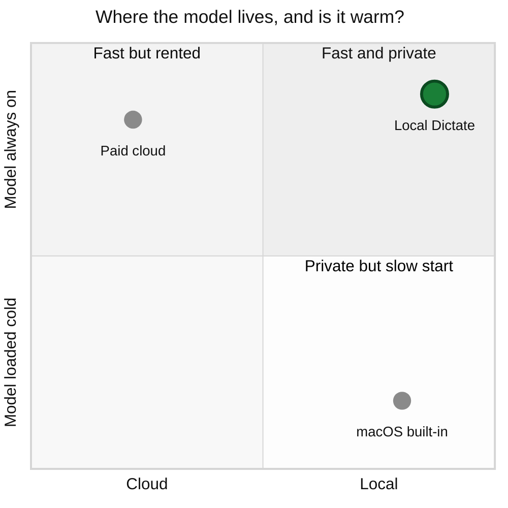

# Local Dictate

Push-to-talk voice dictation for macOS. Tap a key, talk, tap again, and cleaned-up text lands at your cursor. No window, no cloud, no account, works on a plane.

The entire interface. 🎤 idle, 🔴 recording, ⏳ transcribing, back to 🎤. Nothing else appears on screen.

| History | Lifetime stats |
|---|---|
|  |  |

## What it does

- Tap Right Option. Talk. Tap again. The text pastes where your cursor is.
- Transcribes with `whisper.cpp`, then cleans out filler words and applies formatting (lists and quotes) with a local Gemma model.
- Keeps a menu-bar history, so a paste that misses is never a dictation you lost.
- Tap Right Command to paste the last result again.
- Tracks words, dictations, and speaking speed over time.

In daily use since July 2026. As of 2026-09-19: **406 dictations, 29,309 words, 4.5 hours of audio.**

## Why I built this

I've never been satisfied with the native macOS dictation:
- Startup feels slow enough that I still resort to typing, especially for short notes
- Formatting defaults to a block of text, rather than setting off lists and quotes

In contrast, cloud-based dictation tools feel instant and provide amazing context-aware formatting. 
But cloud has significant drawbacks too:
- Requires an internet connection (a significant drawback because I do my most focused work offline)
- I value privacy, and don't want private conversations leaving my device
- The free tiers aren't generous enough for this poor college's kid's dictation needs :/

But now that local models can run on-device, I can get much better responsiveness and smart formatting than just the native macOS dictation

And as a bonus, I can still work offline and my audio never leaves my device.

**The Options:**
**macOS dictation is private and cold.** Free, on-device, already installed. That makes it the honest bar to clear.

The problem is warm-up. If I dictate in bursts through the day, it behaves like the model gets unloaded between uses, and you pay the start-up cost almost every time.

It also stops at basic punctuation. No smart-filler removal, no formatting.

**Paid cloud dictation is fast and rented.** The model is always on because it lives on someone else's server.

It is well built. The price is a subscription, your audio leaving your machine, and long dictations that sometimes stall if the connection is bad.

It is also over-built for my needs: per-app voice profiles and adding screen context.

And it does not work on a plane. Being offline is when I most want to be writing, and a cloud tool is exactly zero use there. I do my best work when I'm not connected to the internet, and so this isn't just an edge case.

**Until recently, local + fast + formatting options weren't practical.** Keeping a model loaded only works if it is small enough to sit in memory next to everything else, and accurate enough to be worth the space.

That combination is recent. Gemma 4 shipped in April 2026, and the Apple Silicon runtime that makes it fast enough to keep warm only became Ollama's default a month after that.

### How I decided what to build

I highly value minimalism, so I sorted features with a Kano lens:

- **Must-be.** Works with no internet. Transcribes accurately. Gets capitalization and basic punctuation right. Lands the text at the cursor and never silently loses it. Nobody praises a dictation tool for any of this. Missing one of them ends it.
- **Performance.** Speed, and only speed. It is the one axis where "better than the built-in one" gets felt instead of argued.
- **Delight.** The formatting that goes past the minimum: filler words removed, spoken lists turned into real lists, spoken punctuation commands honored. Re-paste and lifetime stats. Cheap to build, and the reason to leave something free that already works.
- **Indifferent.** Fully built, tone control, vision context. Enormously expensive and worth nothing to me. This is exactly why the middle of the market was empty: the high end spent its whole budget here.
- **Reverse.** An on-screen overlay. I like the comfort of knowing my dictation tool is primed and ready to go, but I MUCH prefer having it in the top menu that having it floating around the screen somewhere. Screen real estate is precious!

**My tool became the hybrid of macOS dictation and cloud based tools:** 
An extremely lightweight UI (just a menu bar icon + dropdown) + the improved dictation features of cloud-based tools.

## Product decisions and tradeoffs

### 1. Keep the models resident, and pay for it in RAM

**The options.** 
1. Load a model when it is needed and release it after.
2. Keep it resident and eat the memory.

**What I decided.** Whisper loads once at startup and stays. Ollama is pinged proactively to stay warm: when recording starts, when the Mac wakes from sleep, and on an 8-minute heartbeat that sits inside Ollama's 10-minute `keep_alive` window.

**Why.** Constantly unloading and reloading Gemma 4 made dictation feel too inconsistent to use.

I initially hoped Gemma could unload and reload fast enough to be practical.

But in production use, the cleanup pass blew its latency budget 96 times, leaving just Whisper's raw transcription.

The tempting fix was a longer timeout. I rejected it.

I knew that for this tool to actually make it into my daily workflows, I needed formatting to be applied consistently and for the paste to feel almost instant.

**What it cost.** Memory. Ollama's server holds roughly 7GB resident during an active session. On a machine with less headroom this would be the wrong call, and it is the first thing I would revisit.

### 2. A menu-bar icon, not a floating indicator

**The options.** Every dictation tool needs to signal that it's ready to record. The common answer is an on-screen overlay near your cursor or at the bottom of the screen. I initially wanted a floating pill like macOS.

**What shipped.** A menu-bar icon that changes with state: 🎤 idle, 🔴 recording, ⏳ transcribing. No overlay, no window anywhere in the app.

The Dock icon is suppressed via `LSUIElement`, which `docs/PERMISSIONS.md` flags so nobody reports it as a bug.

**Why.** The overlay was the specific thing I disliked about the paid tool. Dictation is something you do *while* doing something else, so anything in the middle of the screen competes with the work.

The menu bar already exists and already holds status. It costs no attention until you look at it.

**What it cost.**
- No live transcript as you speak. That is an explicit non-goal, not an oversight.
- Status is glanceable but not unmissable. If you are full-screen in another app you have to look up.
- History is two clicks away instead of zero.
- On notched Macs the bar is two strips with a dead zone, and macOS will place an overflow item under the notch where it is invisible while still reporting itself as visible. Not fixable in code, because the OS owns placement. The app logs a warning naming the problem instead of pretending it is healthy.

### 3. Smaller models on purpose

**The options.** `whisper.cpp` ships in sizes from tiny through large. Ollama runs Gemma at several sizes. Bigger is more accurate and slower.

**What shipped.** `base.en` for transcription, `gemma4:e2b` for cleanup. Both near the small end.

**Why.** Inference speed is the obvious reason. The real one is decision 1: **small is what makes resident affordable.**

A cold good model loses to a warm adequate one every time. Size is not an accuracy dial here. It is the price of staying warm.

A cleanup pass downstream changes the math too. Transcription does not have to nail punctuation and casing, because the second model fixes exactly those things.

**What it cost.** Accuracy for hard audio. Accented speech, background noise, and unusual proper nouns come back worse than a larger model would give me.

### 4. When cleanup might have dropped words, paste the raw transcript instead

**The problem.** The cleanup model has one job and one hard rule: fix punctuation and filler, change nothing else. It may not answer a question inside your dictation, improve your phrasing, or add a fact.

That rule held. What I did not predict was the model dropping content on its own. Say *"we should ship it exclamation point that is bold huge end bold news"* and Gemma sometimes read the spoken punctuation as the end of the input and returned just *"We should ship it!"* The rest was gone. Not mangled, not flagged, gone.

**What shipped.** A deterministic check that compares surviving word count against the raw transcript. If too much vanished, the cleaned version is thrown away and you get your raw text.

**Why.** Silent loss is a failure that erodes trust for a dictation tool. You cannot notice what is not there, and you cannot say it again the same way. So the guard prefers ugly output over short output.

**What it cost.** Occasionally you see the literal words "exclamation point" in your text. That is the guard working. It beats finding out half a paragraph went missing.

Cleanup can fail in four ways and every one falls back to the raw transcript rather than an error. Audio is written to disk before transcription starts. Every stage checkpoints before the next begins.

## What success looked like, before I built it

`PRD.md` set these targets on 2026-07-19, before any code existed. Measured across 425 latency samples in `logs/latency.log`:

| Target | Actual |
|---|---|
| Short clip (≤3s): ≤ 1.0s, key-release to pasted | **185ms** median ✅ · p90 1.04s, just over |
| Long clip: ≤ 2.5s, hard ceiling 4s | **1.7s** median ✅ · p90 3.3s ✗ over target, inside ceiling |
| Recoverable in ≤ 2 clicks, zero silent data loss | met |
| Cleanup never changes meaning | enforced at runtime, see decision 4 |

## Process

Built by orchestrating three tiers of AI models with an explicit division of labor.

- **Architect and reviewer tier** took the judgment-heavy, project-killing parts: the OS-integration spike, the cleanup system prompt, the durability state machine, and adversarial review of the two critical failure points (lost text, cleanup that changes meaning).
- **Workhorse tier** did the bulk: pipeline glue, menu-bar UI, job store, retry logic, the eval harness.
- **Mechanical tier** narrow, unambiguous work only. 

The guiding rule: **optimize for the fewest total tokens to reach correct code, not the lowest price per token.** A cheap pass that needs three corrections and a senior review costs more than one good pass. Full writeup in `WORKPLAN.md`.

## Privacy

There is no server, no account, and no telemetry. Concretely, here is everything that touches your speech:

| What | Where it goes |
|---|---|
| Audio | Written to `audio/` on your disk, read by `whisper.cpp` locally |
| Transcript | Sent over `localhost:11434` to Ollama on your machine, never off the box |
| Cleaned text | Your clipboard, then pasted at your cursor |
| History | `history.json` on your disk, capped at 50 entries |

`localhost` is the only network address the app contacts, and nothing outbound exists to disable.

Dictation transcripts are written to `logs/app.log` for debugging. **That file is gitignored and should stay that way.** It is a verbatim record of everything you have said.

## Setup

Requires macOS on Apple Silicon.

1. Install [Ollama](https://ollama.com) and pull the cleanup model: `ollama pull gemma4:e2b`
2. Install dependencies: `pip install -r requirements.txt`
3. Grant Accessibility and Microphone permissions. See `docs/PERMISSIONS.md`.
4. Run `python src/app.py`, or package it as a `.app` with `scripts/make_app.sh`

Look for 🎤 in the menu bar. Tap Right Option to start.

## License

MIT. See [LICENSE](LICENSE).

---

